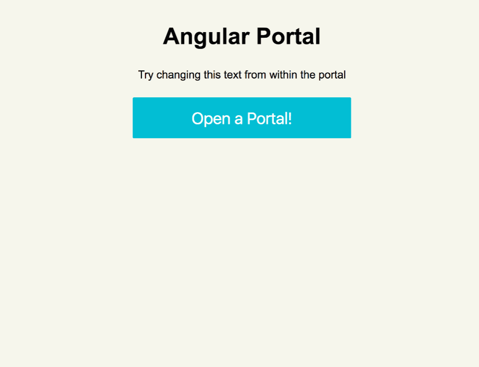

# Angular Portal
A declarative approach for rendering part your components' view somewhere else in the DOM.

Inspired by [Ryan Florence talk about portals in React](https://youtu.be/z5e7kWSHWTg?t=15m21s),
and by the implementation of [portal-vue](https://github.com/LinusBorg/portal-vue).

# Why?

Consider a popup that should open when you click on a button.
A naive approch will be to put the popup near the button: 
```html

<head>
  <style>
    .popup {
      position: absolute;
      left: 50%;
      top: 50%;
      transform: translate(-50%, -50%);
    }
  </style>
</head>
<body>
  <header>
    <button class="login-btn" ng-click="$ctrl.isOpen = true">Login</button>
    <div class="popup" ng-click="$ctrl.isOpen">
      <form name="$ctrl.loginForm">
        <input type="text" placeholder="email">
        <input type="password" placeholder="password">
      </form>
    </div>
  </header>

  <main>
    <h1>Hello World</h1>
  </main>
</body>
```

It works. You have easy access to your $scope and your popup is declared in contextually correct place. <br>
Problem solved. Until, someone put `position: relative` on the `header`:

```html
<body>
  <header class="position: relative">
    <button class="login-btn" ng-click="$ctrl.isOpen = true">Login</button>

    <!--
      Oh-oh.. Your positioned absolute popup is now messed up!
      It's no longer positioned relative to the body, but to the header instead.
      This is not what we want.
    -->
    <div class="popup" ng-if="$ctrl.isOpen">
      <form name="$ctrl.loginForm">
        <input type="text" placeholder="email">
        <input type="password" placeholder="password">
      </form>
    </div>
  </header>

  <main>
    <h1>Hello World</h1>
  </main>
</body>
```


One approch will be to let the button call a service instead:

```js
$ctrl.openLoginPopup = function () {
  LoginPopupSrv.open().then(function (res) {
    console.log(res.username, res.passworld) 
  })
};
```

The service will render the popup at the bottom of the body which will solve the positioning problem. <br>
It will also prevent the popup from inheriting unwanted css properties from the header.

It will work, and in some cases this is the way to go.
But we lost a few things along the way:
* We lost out ability to declare our popup in a declarative manner, instead we call with an imperative API.
* We no longer have easy access to our $scope.
 

This is where portals come to the rescue. With a portal, we can specify that a part of the view should be rendered somewhere else in the DOM,
in our case, the bottom of the body:

```html
<body>
  <header>
    <button class="login-btn" ng-click="$ctrl.isOpen = true">Login</button>

    <!-- What ever is inside the portal will be rendered at the bottom of the body -->
    <portal to="body" ng-if="$ctrl.isOpen">
      <div class="popup">
        <form name="$ctrl.loginForm">
          <input type="text" placeholder="email">
          <input type="password" placeholder="password">
        </form>
      </div>
    </portal>
  </header>

  <main>
    <h1>Hello World</h1>
  </main>
</body>
```

Which result in:

```html
<body>
  <header>
    <button class="login-btn" ng-click="$ctrl.isOpen = true">Login</button>
  </header>

  <main>
    <h1>Hello World</h1>
  </main>

  <!--
    The portal rendered our popup at the bottom of the body.
    Note that our component's $scope is still available here.
  -->
  <div class="popup">
    <form name="$ctrl.loginForm">
      <input type="text" placeholder="email">
      <input type="password" placeholder="password">
    </form>
  </div>
</body>
```

- Portals are unopinionated, they are behavior-only components and have no style.
- A portal serve as a low-level component, <br>
use it to build other components such as popups, tooltips and sliding sidebars

Here is an example of a popup made with angular-portal ([try it yourself](https://github.com/asfktz/angular-portal/tree/master/examples/basic)):



## Install:
Add `angular-portal` to your app:
```js
angular.module('app', ['portal'])
```

## Usage:

```html
<div>
  <input type="text" ng-model="$ctrl.value">

  <portal ng-if="$ctrl.isOpen">
     <!-- you component scope is available here -->
     <div>{{$ctrl.value}}</div>
  </portal>
</div>
```

Your portal will be rendered at the bottom of the body.

Yoy can also specify a different target:

```html
<portal to="otherTarget">
  Content..
</portal>

....

<!-- Somewhere around the DOM -->
<portal-target name="otherTarget"></portal-target>
```

- use `<portal detach="false" .. />` to keep the portal's content in place
